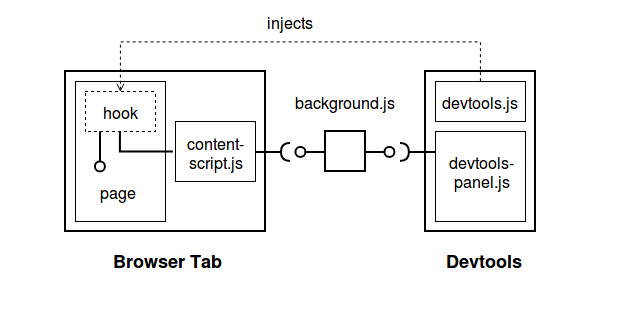

# Chrome DevTools Ping-Pong

This is a minimal example Chrome DevTools extensions that allows you to:

- Create devtools for js libraries and websites
- Communicate (bidirectionally) between a DevTools panel and the page
- Either reload the page and/or reopen the DevTools window and have the extension reestablish the connection automatically

## Installation

* Open `chrome://extensions`
* Enable _'Developer Mode'_ checkbox
* Click _'Load unpacked extension...'_
* Select the folder containing `manifest.json`.

## Usage

From the inspected tab and with the DevTools tab open, run the following in the console. The Devtools panel should respond with 'pong'.

```
window.__TOOLS_HOOK__.ping()
```

## Overview



__When you visit a page__
1. The content-script `content-script.js` is run. This script establishes a connection to the extension background-script, `background.js`, which is responsible for routing messages to and from the dev-panel.

__When the DevTools panel is opened__
1. `devtools.js` injects a script, called the _hook_, in to the inspected tab.
2. The hook runs and assigns the extension api to the window called `__TOOLS_HOOK__`.
3. The hook also establishes a connection to `content-script.js` via `window.addEventListener('message', ...)`.
4. Meanwhile `devtools.js` waits for the hook to be initialized in the inspected window, and once ready the DevTools panel is created.

__When the DevTools tab is selected__
1. `devtools-panel.js` is run, which establishes a connection to `background.js`. Now we have a bidirectional-connection between the DevTools panel and the page itself, via the background script.

When the `ping()` function is invoked, a 'ping' message is sent from the page (via [`window.postMessage`](https://developer.mozilla.org/en-US/docs/Web/API/Window/postMessage)) to the extension content script running in the tab. From there the message is sent (via the [`chrome.runtime`](https://developer.chrome.com/apps/runtime) API) to the extension background script. The message is then routed to the corresponding DevTools panel, which responds with a `pong` message via the same route.
